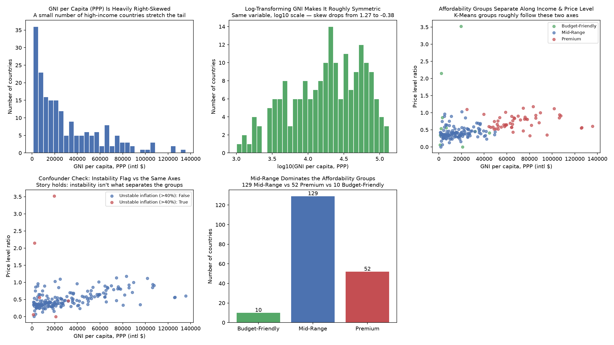

# Exploratory Data Analysis (v1)

Chart source: `notebooks/eda.py` (outputs `notebooks/eda_charts.png`), run
against `data/processed/countries_clean.csv` (191 countries).

## Charts

1. **"GNI per Capita (PPP) Is Heavily Right-Skewed"** — a histogram of raw
   `gni_per_capita_ppp`. Most countries sit under $30,000, with a long tail
   of high-income countries stretching out to $135,750 (Macao SAR China).
2. **"Log-Transforming GNI Makes It Roughly Symmetric"** — the
   transformation: the same variable after a `log10` transform. This is
   the required before/after transformation pair.
3. **"A Few Extreme Outliers Dominate Inflation"** — a histogram of true,
   uncapped `inflation_pct`, showing nearly all countries clustered under
   20% with a handful of extreme hyperinflation cases stretching the axis
   out past 250%.
4. **"Affordability Groups Separate Along Income & Price Level"** — a
   scatter of GNI per capita vs. price level ratio, colored by
   `affordability_group`, showing the three K-Means groups roughly
   separating along these two axes.
5. **"Confounder Check: Instability Flag vs the Same Axes"** — the same
   scatter, colored instead by `economic_instability_flag`, to check
   whether the clustering is really being driven by income/price level or
   by the small number of hyperinflation outliers (see Confounder Check
   below).
6. **"Mid-Range Dominates the Affordability Groups"** — a bar chart of
   group sizes: Mid-Range 129, Premium 52, Budget-Friendly 10.

## Transformation shown (before → after)

`gni_per_capita_ppp` has a raw skew of **1.27** (right-skewed — a small
number of very high-income countries stretch the tail). After a `log10`
transform, skew drops to **-0.38** (close to symmetric). This matters
because K-Means uses Euclidean distance on standardized features — a
heavily skewed raw variable lets the small number of extreme high-income
countries dominate the distance calculation disproportionately. (Note:
the actual clustering step in `clean_data.py` uses `StandardScaler` on the
raw variable, not the log version — this EDA step is flagging the
skewness as a legitimate follow-up refinement, not a change already made.)

## Five properties of the data

- **Structure:** Tabular, one row per country, 12 columns (after cleaning)
  mixing raw indicators, derived features, and the final cluster label.
- **Granularity:** Country-level — the finest level this dataset offers;
  no sub-national (city/region) detail, which matters because actual
  student cost of living varies a lot within a country.
- **Scope:** 191 of the ~201 countries/territories the World Bank API
  returned (small territories and a few countries missing an essential
  indicator were dropped — see CLEANING.md).
- **Temporality:** Each country's values are its own most-recent
  non-empty figure (`mrnev=1`), not a fixed shared year — so this is a
  snapshot, not a true time-aligned panel.
- **Faithfulness:** Four of five core columns are the World Bank's own
  reported figures; `price_level_ratio` is a faithful but manual
  reconstruction after the original precomputed indicator was archived
  (see CLEANING.md Entry 3), so it is a derived approximation, not an
  official WDI field.

## Confounder check

**Question:** Is the K-Means grouping genuinely separating countries by
income and price level, or is it actually just separating out a handful
of extreme-inflation countries?

**Check:** Colored the same GNI-vs-price-level scatter by
`economic_instability_flag` (true inflation > 40%) instead of by cluster.
Only 6 of 191 countries carry the flag (Argentina, Iran, South Sudan,
Sudan, Venezuela, Zimbabwe) — all 6 happen to also fall in the
Budget-Friendly group, and they pull that group's *true* average inflation
up to 97.8%, even though the clustering itself used a capped value (max
40) specifically so these six wouldn't distort the distance calculation.

**Conclusion:** The inflation cap did its job for the clustering math —
these 6 countries are grouped with Budget-Friendly because of genuinely
low income and low price level, not because hyperinflation alone pulled
them there. But the flag check shows a real confound to be upfront about:
"Budget-Friendly" as a group still contains some of the least
economically stable countries in the dataset, so a student reading the
group label alone, without noticing `economic_instability_flag`, could
easily mistake "cheap" for "cheap and stable."

## Three plain-English findings

1. **Income inequality across countries is extreme and skewed, not
   evenly spread** — half of all countries have a GNI per capita under
   $19,990, while the top end reaches $135,750 (Macao SAR China); that's
   why GNI needed a log transform to look at reasonably.
2. **Most countries cluster in the middle** — 129 of 191 (68%) land in
   "Mid-Range," while only 10 are "Budget-Friendly" and 52 are "Premium,"
   so the tool's three-way split is lopsided rather than an even split of
   the world into thirds.
3. **"Cheap" and "economically stable" are not the same thing** — all 6
   countries with true inflation over 40% ended up in the
   "Budget-Friendly" group; a student should check the
   `economic_instability_flag` column, not just the group label, before
   treating a "Budget-Friendly" country as a safe, predictable choice.
